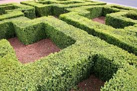

# The Maze Project: The Labyrinth

## Project Overview

The Maze Project, titled "The Labyrinth," is a thrilling 3D maze game developed using SDL2 and ray casting techniques. The project aims to transform a 2D map into an immersive 3D environment, providing entertainment, alleviating boredom, and enhancing problem-solving abilities for a broad audience.

## Features

1. **Immersive 3D Environment**
   - Experience a fully immersive 3D environment transformed from a 2D map.
   - 

2. **Challenging Puzzles**
   - Solve complex puzzles that test your problem-solving skills.
   - 

3. **Interactive Gameplay**
   - Engage in interactive gameplay that keeps you entertained.
   - 

## About The Project

The Maze Project, titled "The Labyrinth," was inspired by my fascination with puzzles and problem-solving. It all started during my college years when I wanted to create a game that not only entertains but also stimulates the mind. This project is a part of my Portfolio Project for ALX, showcasing my skills and dedication to developing engaging software.

**Timeline:** The project began in early 2023 and has been a journey of continuous learning and improvement.

**Connect with me:**
- [GitHub](https://github.com/mouad2023se)
- [Twitter](https://twitter.com/home)

**Project Repository:** [The Maze Project on GitHub](https://github.com/mouad2023se/The-maze-project)
